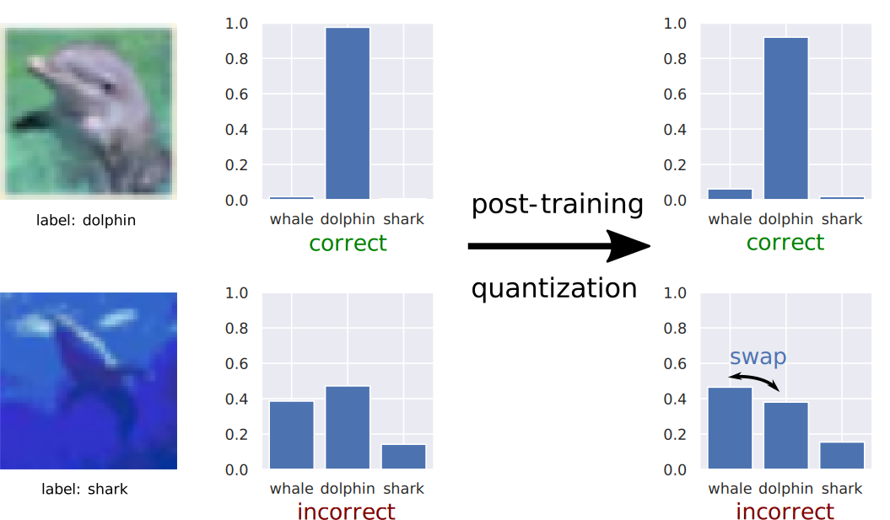

# How Calibration Affects Accuracy After Quantization
Authors: Guoxuan Xia (correspondence to [g.xia21@imperial.ac.uk](mailto:g.xia21@imperial.ac.uk)), Sangwon Ha, Tiago Azevedo and Partha Maji.

[Paper](https://arxiv.org/abs/2111.08163)

Work undertaken as an intern at [Arm Research](https://www.arm.com/resources/research/ml), and accepted at the [ICBINB workshop](https://i-cant-believe-its-not-better.github.io/neurips2021/) at NeurIPS 2021.

## Description
**Calibration** and **quantization** are two seemingly separate concepts in deep learning. We find that in fact **the robustness of accuracy to post-training quantization quantization is closely linked to confidence and calibration.**

* Higher confidence predictions are less likely to change post-quantization.
* Higher confidence predictions will be more accurate.

We can understand post-training quantization as injecting noise into the weights and activations of a neural network. We can then see that high confidence, high accuracy predictions are less likely to change post-quantization, and low confidence, lower accuracy predictions are more likely to change. Thus accuracy remains robust to quantization.

Note that **accuracy stays constant for both cases above**.

## Implementation Details
The repository uses vanilla [PyTorch](https://github.com/pytorch/pytorch/tree/master/torch), with the exception of quantization. Although we only consider post-training quantization, we *simulate* this using the quantization-aware training functiionality that already exists in [PyTorch's built-in quantization functionality](https://pytorch.org/docs/stable/quantization.html). Code can be found in `utils/quant_utils.py` and `test.py`.

## Experiments
We provide scripts to replicate the experiments found in the paper, for:

* CIFAR-100: ResNet20, ResNet56
* ImageNet: [ResNet50]("resnet50-19c8e357.pth"), [MobileNetV2](https://download.pytorch.org/models/mobilenet_v2-b0353104.pth)

We provide weights for trained CIFAR-100 models, as well as scripts for training from scratch. Weights for ImageNet models should be downloaded from PyTorch and placed in the corresponding directories in `models/saved_models`.

Before running the scripts, you need to edit the `.json` files in `experiment_configs`. 
* `"datapath"` within `"id_dataset"` needs to be changed to point to the corresponding dataset in your system (in the same way you would pass the directory to the [torchvision dataset](https://pytorch.org/vision/stable/datasets.html)).
* `"results_savedir"` within `"test_params"` should point to a directory where you want results to be saved. Note that logits for the ImageNet validation set will be saved, which are approximately 1.2GB per evaluation.

To run the scripts, navigate to `experiment_scripts`, make them executable using `chmod +x *` and run with `./<script>.sh`
